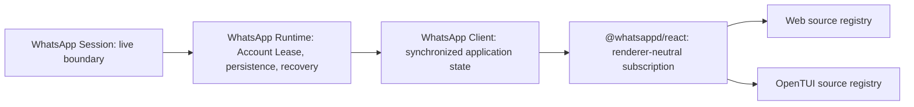

The WhatsApp Session is the direct, live protocol boundary. The WhatsApp Runtime adds the Account Lease, Current Mirror, media storage, and queued WhatsApp Operations. The WhatsApp Client turns those capabilities into stable chat/contact/group/message namespaces. `@whatsappd/react` adapts the WhatsApp Client to React’s external-store contract without importing a renderer.

The web and OpenTUI layers remain editable source because presentation is product-specific. They share WhatsApp Client semantics and a package-family version, not DOM, CSS, or terminal primitives.
