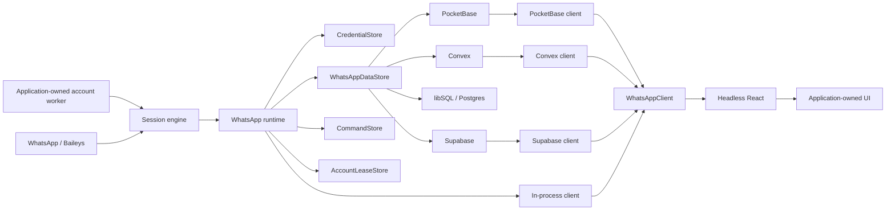

# WhatsApp application runtime, pluggable backends, and headless React

Status: proposed target architecture

Date: 2026-07-29

This document consolidates the broader WhatsApp UI/runtime design with the
separate PocketBase/libSQL plan from
`docs/feature-requests/pluggable-credential-and-data-backends.md` in the
`c1f3/whatsappd` worktree. It is the single design to carry forward.

It describes a target, not code that already exists. The current package still
exports the Eve-era channel adapter, sidecar, and agent tools.

## Decision

`whatsappd` should become an application substrate for WhatsApp:

1. The existing session remains the live WhatsApp protocol engine.
2. A new runtime consumes the complete normalized session event stream and
   maintains a durable WhatsApp-native mirror.
3. Optional backend packages provide credentials, durable data, commands,
   realtime delivery, migrations, and browser clients for PocketBase, Convex,
   libSQL, Postgres, and Supabase.
4. A backend-independent client contract feeds a headless React package.
5. Applications create the runtime inside a long-lived Node process. That
   application-owned process may be dedicated to one WhatsApp account, but
   `whatsappd` does not initially ship a generic daemon or HTTP transport.
6. Pairing is an account lifecycle command issued after account creation, not
   immutable runtime-constructor configuration.
7. `ChannelEvent`, `WhatsAppChannelAdapter`, the Eve adapter, the current
   webhook sidecar, and agent-specific tools leave the core product.

The important ownership boundary is:

> `whatsappd` owns WhatsApp state and the portable contracts for storing and
> consuming it. Applications own product policy built on top of that state.

That means PocketBase and Convex support are not handwritten separately in
every application. Their adapters, schemas, migrations, and conformance tests
belong to `whatsappd`. An application still owns its inbox admission,
retention, agent windows, search, knowledge extraction, and other product
semantics.

## The sidecar is retired

The current sidecar is an Eve-era HTTP webhook bridge over the reduced
`ChannelEvent` model. No inspected working application uses it as its WhatsApp
integration, and a dedicated operating-system process does not require a
generic daemon: application code can create the same runtime inside a
one-account worker process.

The sidecar package, wire protocol, and CLI are therefore removed rather than
renamed. A generic daemon or HTTP client transport can be proposed later if a
real non-Node or remote-process consumer proves that application-owned
composition and backend-native clients are insufficient.

## Architecture



The module boundaries are deliberately deeper than the current
channel/sidecar split:

| Module          | Owns                                                                                                                             | Does not own                                                  |
| --------------- | -------------------------------------------------------------------------------------------------------------------------------- | ------------------------------------------------------------- |
| Session engine  | Baileys socket, credentials, reconnect, normalization, lazy live media, native WhatsApp commands                                 | Databases, HTTP, React, PocketBase, Convex, agent frameworks  |
| Runtime         | Account creation, dynamic pairing, complete event ingestion, durable projection, commands, reconciliation, lifecycle, and leases | Application identity, process supervision, product policy, UI |
| Backend package | Credential/data/command implementations, migrations, constraints, realtime client, access-rule templates                         | The application’s identity model or product tables            |
| Client          | Snapshot-first reads, live patches, commands, connection state                                                                   | React and visual rendering                                    |
| Headless React  | Provider, hooks, selectors, optimistic state, render slots                                                                       | DOM, CSS, component library, backend SDK selection            |

## Why the current seams should not survive

The current code already contains a richer and better lower-level boundary:

- `src/session.ts` exposes connection, messages, conversation sync, updates,
  contacts, groups, presence, and native commands.
- `src/ports.ts` defines `SessionStore`, which is specifically an opaque
  credential store.
- `src/channel/types.ts` reduces the system to message, update, and status
  events for Eve/Flue-style agent frameworks.
- `src/channel/adapter.ts` pumps only those three streams, does not await
  subscriber promises, and implements `markRead(chatId)` by inventing an empty
  message ID.
- `src/sidecar/server.ts` forwards those reduced events to webhook targets.
  Delivery failures are logged and discarded, and messages sent by the linked
  account are dropped.
- `src/sidecar/wire.ts` is consequently a lossy agent bridge rather than a
  complete WhatsApp client protocol.
- `package.json` still describes the package as an AI-agent channel and exports
  Eve, sidecar, and tools entry points.

`ChannelEvent` is therefore the wrong foundation for persistence or UI. It was
useful for a specific agent-framework integration, but it cannot represent the
state a WhatsApp client needs.

The replacement is not a larger `ChannelEvent`. It is a complete normalized
`WhatsAppEvent` emitted by the session engine and consumed by the runtime.

## Evidence from existing applications

The local applications do not establish the current sidecar as the reusable
architecture:

| Application      | Observed integration                                                                                                                             | Consequence                                                                                              |
| ---------------- | ------------------------------------------------------------------------------------------------------------------------------------------------ | -------------------------------------------------------------------------------------------------------- |
| Ambient Agent    | Creates `WhatsAppSession` in-process and projects it into its own archive before Flue dispatch                                                   | The socket/runtime can be embedded; Flue is downstream product policy                                    |
| Ambient Agent v3 | Subscribes directly to all session streams and writes a raw PocketBase corpus                                                                    | PocketBase is a real first consumer; account stamping and awaited persistence are missing from the spike |
| Open Coworker    | Its design explicitly embeds the WhatsApp supervisor in the long-lived Hono server                                                               | Useful donor for UI and supervision, but deprecated as a destination                                     |
| Twinin           | Has an app-specific “sidecar” composition that does not yet open Baileys sockets, while its current live path is in-process and writes to Convex | Convex needs an adapter; this does not validate the existing `whatsappd/sidecar`                         |
| ok-sync          | Describes a possible future separate process but does not currently consume `whatsappd` that way                                                 | Future topology is not a reason to hard-code sidecar ownership now                                       |

The common denominator is a long-lived runtime plus a durable projection, not
Eve, Flue, webhooks, or a mandatory second process.

## Core session boundary

`createSession()` remains usable by consumers that need only the current
low-level live connection API:

```ts
const session = createSession({
  auth: qrAuth(),
  store: fileCredentialStore("./data/whatsapp-auth"),
});

await session.start();
```

The durable runtime does not require a phone number or pairing method at
construction:

```ts
const backend = pocketBaseBackend({
  client: adminPocketBase,
  accountId: "personal",
});

const whatsapp = createWhatsAppRuntime({
  accountId: "personal",
  backend,
});

await whatsapp.start();
```

`start()` resumes when credentials already exist and otherwise reports that the
account needs pairing. The application can then choose either method at
runtime:

```ts
// Pairing-code UI:
const challenge = await whatsapp.pair({
  method: "pairing_code",
  phoneE164: phoneCollectedFromTheUser,
});

// Or QR UI:
const qr = await whatsapp.pair({ method: "qr" });
```

The phone is validated when the pairing command crosses the runtime boundary.
It is neither an environment-only value nor permanent account configuration.
Pairing is rejected once usable credentials exist unless the account is
explicitly unlinked first.

One backend factory may provide all capabilities over one configured
connection, but the capabilities stay logically separate and independently
replaceable:

```ts
const whatsapp = createWhatsAppRuntime({
  accountId: "personal",
  backend: {
    credentials: libsqlCredentialStore({
      client: localDatabase,
      accountId: "personal",
    }),
    data: pocketBaseDataStore({
      client: adminPocketBase,
    }),
    commands: pocketBaseCommandStore({
      client: adminPocketBase,
    }),
  },
});
```

This supports “use PocketBase here, Convex there, libSQL locally” without
making applications implement WhatsApp persistence themselves.

## Credentials and WhatsApp data are separate capabilities

The existing `SessionStore` contract is a credential store:

```ts
export interface CredentialStore {
  read(key: string): Promise<string | null>;
  write(entries: Record<string, string | null>): Promise<void>;
  clear(): Promise<void>;
}

/** @deprecated Use CredentialStore. */
export type SessionStore = CredentialStore;
```

Durable WhatsApp state has different invariants:

```ts
export interface WhatsAppDataStore {
  apply(accountId: string, events: readonly WhatsAppDataEvent[]): Promise<AppliedWhatsAppBatch>;

  snapshot(accountId: string): Promise<WhatsAppSnapshot>;
}
```

They must not be collapsed into one store because:

- credentials are opaque Signal/Baileys secrets;
- client data is structured and queryable;
- credential `clear()` is called on terminal logout and must not erase chats;
- credentials must never cross a browser boundary;
- backup, encryption, migration, and retention policies differ;
- a live session requires credentials but not a durable client mirror;
- an application may intentionally mix physical backends.

A convenience backend groups capabilities; it does not erase their boundaries:

```ts
export interface WhatsAppBackend {
  readonly credentials: CredentialStore;
  readonly data: WhatsAppDataStore;
  readonly commands: WhatsAppCommandStore;
  readonly leases?: AccountLeaseStore;
}
```

Remote credential adapters should require host-side encryption material or an
equivalent trusted secret-store integration. A browser-authenticated backend
client must never be sufficient to read WhatsApp device credentials.

## Complete normalized event surface

The session should add one ordered event surface at the point where normalized
events are already produced:

```ts
export type WhatsAppEvent =
  | { type: "connection"; status: Status }
  | { type: "conversation_sync"; batch: ConversationSyncBatch }
  | { type: "message"; message: InboundMessage }
  | { type: "update"; update: Update }
  | { type: "contact"; contact: ContactUpdate }
  | { type: "group"; group: GroupUpdate }
  | { type: "presence"; presence: PresenceUpdate };

export interface WhatsAppSession {
  readonly events: AsyncIterable<WhatsAppEvent>;
  // Existing streams and callbacks remain during migration.
}
```

The session emits WhatsApp-native events. The runtime adds `accountId`,
observation metadata, and durable revision information:

```ts
export interface WhatsAppDataEvent {
  readonly accountId: string;
  readonly observedAt: number;
  readonly event: Exclude<WhatsAppEvent, { type: "presence" }>;
}
```

Presence stays live-only initially. Persisting “typing” or “online” and
restoring it after a restart would manufacture false current state.

The runtime must await durable application before publishing the corresponding
client patch:

```ts
for await (const event of session.events) {
  if (event.type === "presence") {
    publishLivePresence(accountId, event.presence);
    continue;
  }

  const applied = await data.apply(accountId, [
    {
      accountId,
      observedAt: Date.now(),
      event,
    },
  ]);

  publish(applied.patch);
}
```

This is a semantic requirement, not illustrative error handling:

- a failed write is observable;
- the event is not reported to clients as durably accepted;
- the runtime enters a degraded state or retries ingestion under an explicit
  policy;
- a webhook-style “log and discard” path is not allowed.

## Canonical durable mirror

The mirror represents current WhatsApp state, not an application event archive.
Its portable domain model is:

```text
credentials                 server-only, separate lifecycle

accounts
chats
contacts
groups
group_members
messages
message_reactions
message_receipts
media                       metadata and durability state, not necessarily bytes
commands
command_attempts
runtime_state               revision, sync state, last error
account_leases              only where deployment topology needs them
```

All durable records are explicitly account-scoped. No adapter may infer
`accountId` from insertion order, a message ID, the current process, or a
backend user.

At minimum, adapters enforce equivalent identities:

```text
chat:         (account_id, chat_id)
contact:      (account_id, contact_id)
group:        (account_id, group_id)
participant:  (account_id, group_id, participant_id)
message:      (account_id, chat_id, message_id)
reaction:     (account_id, chat_id, message_id, actor_id)
receipt:      (account_id, chat_id, message_id, actor_id, receipt_kind)
command:      (account_id, client_command_id)
```

Message edits and revocations update the current message projection. Keeping an
immutable edit history is an application archive concern unless a concrete
WhatsApp-client requirement later proves otherwise.

Conversation sync is an upsert, not an unconditional replacement:

- a returning linked session may emit zero history batches;
- zero batches must preserve the previous snapshot;
- records are removed only when WhatsApp emits a definite removal/revocation or
  the protocol marks a synchronization batch as an authoritative replacement;
- replaying the same message, update, contact, or group event is idempotent.

## Media boundary

The initial mirror persists normalized media metadata:

```text
mimetype
file_name
file_length
duration
dimensions
caption
availability
```

It does not claim that media bytes are durable. The current `MediaHandle`
contains a live `download()` closure and cannot survive JSON serialization or a
process restart.

The initial clients may expose:

```ts
type MediaAvailability =
  | { status: "live"; download: () => Promise<Uint8Array> }
  | { status: "stored"; url: string }
  | { status: "unavailable" };
```

Durable blob storage is a separate optional capability to add when a real
consumer needs it. PocketBase files, Convex storage, Supabase Storage, and an
HTTP host should implement the same media contract when that slice exists.

## Commands and optimistic reconciliation

The client must expose WhatsApp commands, not agent tools:

```ts
export type WhatsAppCommand =
  | SendMessageCommand
  | MarkReadCommand
  | SetTypingCommand
  | ReactCommand
  | EditMessageCommand
  | RevokeMessageCommand;
```

`MarkReadCommand` carries real message references. It must not repeat the
current channel adapter’s empty-message-ID shortcut.

Backends with browser-accessible mutations use a durable command queue:

```ts
export interface WhatsAppCommandStore {
  submit(accountId: string, command: WhatsAppCommand): Promise<WhatsAppCommandReceipt>;

  take(
    accountId: string,
    options?: { signal?: AbortSignal },
  ): AsyncIterable<ClaimedWhatsAppCommand>;

  complete(accountId: string, commandId: string, result: WhatsAppCommandResult): Promise<void>;
}
```

The runtime is the only component that executes these commands against the
session. Command state is:

```text
pending -> running -> succeeded | failed
```

Each submission has an application-generated idempotency key. Transport
retries may safely return the same receipt, but WhatsApp command execution is
not transparently retried after an ambiguous socket failure. A retry of
`sendMessage` can duplicate a real message.

The client may show an optimistic message keyed by `clientCommandId`. The
runtime reconciles it with the authoritative outbound message echo or command
result, then replaces or marks the optimistic record.

## Backend-independent client

React and application code consume one contract:

```ts
export interface WhatsAppClient {
  watch(options?: {
    accountId?: string;
    signal?: AbortSignal;
  }): AsyncIterable<
    | { type: "snapshot"; snapshot: WhatsAppSnapshot }
    | { type: "patch"; patch: WhatsAppPatch }
    | { type: "presence"; presence: PresenceUpdate }
    | { type: "connection"; state: WhatsAppClientConnectionState }
  >;

  execute(
    command: WhatsAppCommand,
    options?: { signal?: AbortSignal },
  ): Promise<WhatsAppCommandReceipt>;
}
```

Every `watch()` starts with a store-backed snapshot. Live patches delivered
after it are ordered after that snapshot.

The implementation may subscribe before reading and buffer/deduplicate updates,
or use a backend’s consistent reactive query mechanism. The contract owns that
race; React components do not.

On reconnect, the client receives a fresh snapshot. A general durable event
journal and resumable replay cursor are deferred until a real consumer proves
snapshot replacement insufficient.

Concrete clients are:

```ts
createInProcessWhatsAppClient(runtime)
createPocketBaseWhatsAppClient({ client: authenticatedPocketBase })
createConvexWhatsAppClient({ client: authenticatedConvex })
createSupabaseWhatsAppClient({ client: authenticatedSupabase })
createMemoryWhatsAppClient(...)
```

The backend client is chosen once at the application composition root. The UI
does not contain `if (pocketbase)` or backend-specific query code. A future
remote transport can implement the same contract without changing React, but
it is not part of the initial package family.

## Headless React

`@whatsappd/react` owns state synchronization and interaction behavior, not
markup or styling.

```tsx
const client = createPocketBaseWhatsAppClient({
  client: authenticatedPocketBaseClient,
});

<WhatsAppProvider client={client}>
  <Conversation.Root chatId={chatId}>
    <Conversation.Messages>
      {({ messages, status, loadOlder }) => (
        <MyMessageList messages={messages} status={status} onLoadOlder={loadOlder} />
      )}
    </Conversation.Messages>

    <Conversation.Typing>
      {({ participants }) => <MyTypingIndicator people={participants} />}
    </Conversation.Typing>

    <Conversation.Composer>
      {({ draft, setDraft, submit, pending, error }) => (
        <MyComposer
          value={draft.text}
          onChange={(text) => setDraft({ text })}
          onSubmit={submit}
          pending={pending}
          error={error}
        />
      )}
    </Conversation.Composer>
  </Conversation.Root>
</WhatsAppProvider>;
```

The package also exposes hooks for applications that do not want compound
components:

```ts
useWhatsAppConnection();
useWhatsAppAccounts();
useChats();
useChat(chatId);
useMessages(chatId);
usePresence(chatId);
useComposer(chatId);
useWhatsAppCommand();
```

The provider owns:

- one client subscription per provider;
- snapshot hydration and patch application;
- selectors and structural sharing;
- optimistic command state and reconciliation;
- typing expiry;
- read-receipt batching with real message references;
- reconnect and stale-state handling;
- stable callbacks and aborting work on unmount.

The provider does not render a `div`, ship CSS, require Tailwind, assume a
component library, or imitate WhatsApp’s visual design. Open Coworker can donate
interaction and information-architecture lessons, but it is not a package
dependency or the new product foundation.

## Backend packages

The initial public package family is limited to working vertical slices:

```text
whatsappd
@whatsappd/react
@whatsappd/pocketbase
```

`@whatsappd/convex` is added when the Convex vertical slice begins. libSQL,
Postgres, Supabase, and shared testing packages are published only when their
complete adapter surfaces have real consumers; empty placeholder packages are
not shipped.

`whatsappd` contains the session, runtime, domain contracts, and in-process
client. Backend SDKs and React do not enter its default dependency graph.

Each backend package may expose server and client subpaths:

```text
@whatsappd/pocketbase/server
@whatsappd/pocketbase/client
@whatsappd/pocketbase/migrations

@whatsappd/convex/server
@whatsappd/convex/client
@whatsappd/convex/component
```

Existing credential imports remain compatibility aliases during migration:

```text
whatsappd/stores/memory  -> memoryCredentialStore
whatsappd/stores/libsql  -> libsqlCredentialStore
```

The old agent-era subpaths are retired rather than carried into the new
architecture:

```text
whatsappd/adapters/eve
whatsappd/sidecar
whatsappd/tools
```

If a real consumer still needs AI-framework tool wrappers, they can later live
in a separate `@whatsappd/ai` package built on `WhatsAppClient.execute()`.
There is no reason to keep them in the core speculatively.

## PocketBase adapter

PocketBase is the first complete backend because Ambient Agent v3 is already a
real consumer:

- [`ambient-agent-v3#1`](https://github.com/AaronAbuUsama/ambient-agent-v3/issues/1)
  requires PocketBase-backed WhatsApp credentials;
- [`ambient-agent-v3#2`](https://github.com/AaronAbuUsama/ambient-agent-v3/issues/2)
  requires account-scoped message, chat, contact, and account views.

The package supplies:

```ts
const backend = pocketBaseBackend({
  client: adminPocketBase,
  accountId: "personal",
  prefix: "whatsappd",
});

const client = createPocketBaseWhatsAppClient({
  client: authenticatedPocketBaseClient,
  accountId: "personal",
});
```

It also exposes the capabilities independently:

```ts
pocketBaseCredentialStore(...)
pocketBaseDataStore(...)
pocketBaseCommandStore(...)
```

The server adapter uses privileged account-worker credentials. The browser
client uses an already-authenticated application client.

Default collections are conceptually:

```text
whatsappd_credentials
whatsappd_accounts
whatsappd_chats
whatsappd_contacts
whatsappd_groups
whatsappd_group_members
whatsappd_messages
whatsappd_message_reactions
whatsappd_message_receipts
whatsappd_media
whatsappd_commands
whatsappd_command_attempts
whatsappd_runtime_state
whatsappd_account_leases
```

Requirements:

- credential rules are locked to privileged server access;
- every data record is explicitly account-scoped;
- account/chat/message and related identities have unique indexes;
- writes are idempotent upserts;
- multi-record mutations use PocketBase’s transactional batch API or a
  server-side transaction;
- migrations are versioned, inspectable, and committed;
- collection prefix is configurable without leaking collection names into the
  domain contract;
- realtime subscriptions obey collection access rules;
- credential `clear()` affects only one account’s credential rows;
- protected media files are not exposed by public URLs.

PocketBase View collections may provide backend-native derived read models, but
the portable client and store contracts do not expose PocketBase collection or
filter syntax.

PocketBase provides versioned JavaScript migrations, collection API rules, and
a batch records API. Those native features should be used rather than building
a generic migration or authorization layer:

- [PocketBase JavaScript migrations](https://pocketbase.io/docs/js-migrations/)
- [PocketBase API rules and filters](https://pocketbase.io/docs/api-rules-and-filters/)
- [PocketBase records and batch API](https://pocketbase.io/docs/api-records/)

The default access template may use an owner relation from
`whatsappd_accounts` to a configured PocketBase auth collection. Team or
organization applications can replace that rule template with their own
membership relation. `whatsappd` supplies secure rules and fields; it does not
decide which application users belong to an account.

The current v3 spike remains evidence and fixture material, not the production
schema. It writes a raw event collection with fire-and-forget callbacks and
filesystem credentials. The adapter replaces those behaviors with awaited,
account-scoped, normalized writes and server-only credentials.

## Convex adapter

Convex is a first-class peer of PocketBase, not an application-specific
projection. Baileys never runs inside a Convex function: a long-lived
application-owned Node worker owns the socket and calls the Convex deployment
through its JavaScript client.

The installed component owns the durable schema and functions:

```ts
// convex/convex.config.ts
import whatsappd from "@whatsappd/convex/component";

app.use(whatsappd);
```

The external worker composes the runtime with the server adapter:

```ts
// Long-lived Node process, not a Convex function.
const backend = convexBackend({
  accountId: "personal",
  client: serviceAuthenticatedConvexClient,
  api: api.whatsappService,
});

const whatsapp = createWhatsAppRuntime({
  accountId: "personal",
  backend,
});

await whatsapp.start();
```

`api.whatsappService` is application-mounted server glue. It verifies the
worker’s service credential, then calls the component:

```ts
export const ingest = mutation({
  args: serviceIngestArgs,
  handler: async (ctx, args) => {
    await requireWhatsAppWorker(ctx, args.serviceToken, args.accountId);
    return ctx.runMutation(components.whatsappd.ingest, args.event);
  },
});
```

The browser uses the ordinary authenticated Convex React client:

```ts
const client = createConvexWhatsAppClient({
  client: authenticatedConvexReactClient,
  api: api.whatsapp,
  accountId: "personal",
});
```

The worker writes normalized events through Convex mutations and uses a
long-lived Convex subscription to receive pending commands for its account. It
executes each command against Baileys, then records the result and authoritative
outbound echo through another mutation. Convex owns transactions, queries,
command records, and the current mirror; it does not own the socket lifecycle.

Convex queries are reactive and consistent, so the browser adapter translates
native query updates into `WhatsAppClient` snapshots and patches instead of
implementing a second websocket protocol. `@whatsappd/react` therefore works
unchanged: it consumes `WhatsAppClient`, not the worker process.

Convex components do not directly receive the parent application’s auth
context. The package therefore supplies application-side query/mutation
wrappers that authenticate with the host app and pass an authorized principal
or account scope into the component. It must not pretend that installing a
component automatically defines the app’s user-to-account policy.

The external worker authenticates as a service, not as an application user.
Its credential and mutation functions validate that service boundary and are
never re-exported to browser clients. WhatsApp device credentials are encrypted
before storage and can be read only through that service-authorized path.

Relevant native facilities:

- [Convex components](https://docs.convex.dev/components/understanding)
- [Authoring components and their authentication boundary](https://docs.convex.dev/components/authoring)
- [Convex realtime queries](https://docs.convex.dev/realtime)

## libSQL and plain Postgres adapters

libSQL is the SQL reference because the repository already ships a credential
adapter and already has an optional `@libsql/client` dependency.

The existing credential table remains the compatibility floor:

```sql
CREATE TABLE wa_auth (
  account TEXT NOT NULL,
  key TEXT NOT NULL,
  value TEXT NOT NULL,
  PRIMARY KEY (account, key)
)
```

The libSQL package:

- preserves the current account-scoped `wa_auth` behavior;
- exposes `libsqlCredentialStore(...)`, `libsqlDataStore(...)`, and
  `libsqlCommandStore(...)` independently as well as through
  `libsqlBackend(...)`;
- adds versioned client-data migrations;
- uses database constraints for canonical identities;
- applies related projection changes in a transaction;
- reconstructs the same `WhatsAppSnapshot` as PocketBase;
- supports separate database clients for credentials and data;
- does not claim to provide application authentication or browser-safe
  realtime.

Plain Postgres follows the same server-side contract once there is a concrete
consumer. It does not require a generic ORM, collection abstraction, or
database-agnostic query language.

libSQL and plain Postgres do not automatically provide a browser-safe client or
application authentication. Their first adapters are therefore server-side
only. An application may expose its own authorized routes over
`WhatsAppClient`; a reusable HTTP transport remains deferred until a real
consumer proves that repeated application glue warrants another public
package.

## Supabase adapter

Supabase is a Postgres deployment with a meaningful additional client
capability: Auth, browser data access, storage, and realtime.

The server adapter uses a trusted server client. The browser adapter accepts an
already-authenticated Supabase client. Shipped SQL migrations enable RLS on
every exposed table and include owner-scoped policy templates. Applications
with organization membership replace or extend those templates.

Supabase Auth and RLS remain native:

- [Supabase Auth](https://supabase.com/docs/guides/auth)
- [Supabase row-level security](https://supabase.com/docs/guides/database/postgres/row-level-security)
- [Supabase Realtime](https://supabase.com/docs/guides/realtime/getting_started)

The service role key and WhatsApp credentials never enter browser bundles.

## Authentication ownership

There are three distinct identities:

1. WhatsApp device credentials used by the account worker to maintain the
   linked device.
2. Backend service credentials used by the runtime to mutate the mirror.
3. Application user identity used by a browser to read accounts and submit
   commands.

They must not be conflated.

`whatsappd` does not introduce a fourth authentication system. Instead:

- PocketBase clients arrive already authenticated by a PocketBase auth
  collection and are constrained by collection rules.
- Convex wrappers use the application’s `ctx.auth` and pass authorized scope
  into the component.
- Supabase clients arrive with an Auth session and are constrained by RLS.
- application-owned HTTP routes perform application authorization before
  calling a server-side client.
- direct in-process clients inherit the application process trust boundary.

Backend packages ship secure defaults and authorization integration points.
The application decides which user or organization can access which WhatsApp
account.

## Application-owned account workers

The runtime always lives in application-owned long-running Node code. The
application may embed it in an existing server or run the same small worker
entrypoint once per WhatsApp account:

```text
account worker: master -> WhatsApp runtime(accountId=master) -> backend
account worker: self   -> WhatsApp runtime(accountId=self)   -> backend
```

“Application-owned” describes who composes the runtime, not how many operating
system processes exist. Each account worker must acquire its account lease
before opening Baileys, so accidentally starting the same account twice fails
closed.

PocketBase, Convex, and Supabase clients read the backend directly under native
auth and realtime:

```text
browser -> authenticated backend client -> WhatsApp mirror/commands
account worker -> privileged backend adapter -> WhatsApp mirror/commands
```

The browser and `@whatsappd/react` do not need to connect to the account worker
merely because it is another process.

## Implementation plan

### Slice 1: contracts and memory proof

- Rename `SessionStore` to `CredentialStore` with a compatibility alias.
- Add the complete ordered `WhatsAppEvent` surface without removing existing
  streams.
- Define normalized durable events, snapshots, patches, commands, and the
  client contract.
- Implement the runtime with memory data/command stores.
- Add shared credential, data, command, and client conformance tests.
- Prove persist-before-publish and snapshot-first ordering.

Exit proof:

- replaying the same inputs produces one current mirror;
- a failed data write produces no successful client patch;
- a returning session with zero sync batches retains its snapshot;
- real message references reach `markRead`;
- two accounts do not cross-contaminate.

### Slice 2: PocketBase vertical slice

- Ship PocketBase credentials, data, commands, migrations, indexes, and access
  rule templates.
- Replace the Ambient Agent v3 raw spike path with the production adapter.
- Prove process replacement, collection/index/rule readback, terminal
  credential clearing, and authenticated account isolation.
- Implement the PocketBase `WhatsAppClient`.

Exit proof:

- pair one real account;
- ingest history and a live inbound message;
- restart the runtime;
- reconnect with zero history batches;
- read the retained snapshot as an authorized browser user;
- send one command and reconcile its outbound echo;
- prove another authenticated user cannot read or command the account.

### Slice 3: headless React vertical slice

- Implement `WhatsAppProvider`, core hooks, and the conversation render slots.
- Build one unstyled test application against the PocketBase client.
- Prove hydration, live inbound updates, optimistic send/reconciliation,
  typing expiry, read batching, reconnect, and error state.

This is the point at which the “WhatsApp UI SDK” is real. A typechecked provider
without a live backend/browser proof is not acceptance.

### Slice 4: Convex vertical slice

- Ship the Convex component, server adapter, auth wrappers, and client.
- Run the same backend/client conformance suite.
- Exercise it in one existing Convex application rather than a synthetic-only
  fixture.

Exit proof matches PocketBase except that schema/function installation,
component isolation, and application auth wrappers replace collection/rule
readback.

### Slice 5: libSQL server adapter

- Extend the existing libSQL integration from credentials to the durable
  mirror and commands.
- Add SQL migrations and constraints.
- Prove an application-owned server client and a process-replacement snapshot.
- Do not add a generic HTTP transport without a concrete remote consumer.

### Slice 6: retirement and package cleanup

- Remove channel, Eve adapter, current sidecar, and core agent tools.
- Update package description, keywords, exports, README, and examples.
- Preserve only deliberate credential-store compatibility aliases.
- Run packed clean-consumer tests for every public package/subpath.

Supabase and plain Postgres follow after a concrete consumer chooses them. Their
contracts are planned; speculative implementations are not.

## Shared conformance suite

The conformance suite starts as repository-internal test support and every
backend must pass it. It becomes `@whatsappd/testing` only when a real
out-of-repository adapter author needs the harness:

### Credential store

- batch write/read/delete;
- account isolation;
- terminal clear removes credentials only;
- secret values never appear through the browser client.

### Data store

- idempotent message and sync replay;
- update-before-message and message-before-update handling;
- contact/group/participant upserts;
- current reactions and receipts;
- zero-sync reconnect retention;
- transaction rollback on a failed multi-record batch;
- equivalent snapshot normalization;
- media metadata never implies stored bytes.

### Command store

- idempotent submission;
- one claim for one command;
- terminal result visibility;
- no automatic re-execution after an ambiguous failure;
- account isolation.

### Client

- first frame is a snapshot;
- subsequent patches are ordered after it;
- reconnect replaces state with a fresh snapshot;
- cancellation releases subscriptions;
- unauthorized reads and commands fail closed.

## Acceptance criteria

### Architecture

- [ ] The session remains usable without a data backend.
- [ ] The runtime consumes every normalized WhatsApp event category.
- [ ] Credentials, data, commands, and leases are separate capabilities.
- [ ] One backend can conveniently provide all capabilities.
- [ ] Capabilities from different backends can be mixed.
- [ ] “Sidecar” appears only as an optional deployment description.

### Persistence

- [ ] Every durable record is explicitly account-scoped.
- [ ] Ingestion is idempotent.
- [ ] Persistence completes before a successful client patch is published.
- [ ] Persistence failures are visible and tested.
- [ ] Zero-sync reconnects preserve prior data.
- [ ] Presence is never restored as current truth.
- [ ] Credential clearing cannot erase the WhatsApp mirror.
- [ ] Media metadata does not claim durable bytes.

### Client and UI

- [ ] React imports no PocketBase, Convex, Supabase, or SQL SDK.
- [ ] Every watch begins with a consistent snapshot.
- [ ] Optimistic sends reconcile with authoritative results.
- [ ] Headless components render no DOM or CSS.
- [ ] Hooks and render slots work with at least PocketBase and Convex clients.

### Authentication and security

- [ ] WhatsApp credentials are host-only and encrypted appropriately at rest.
- [ ] Backend service credentials never enter browser bundles.
- [ ] PocketBase rules, Convex wrappers, Supabase RLS, and HTTP authorization
      fail closed.
- [ ] Multi-user and multi-account isolation have executable proof.

### Packaging

- [ ] Default `whatsappd` does not install backend or React SDKs.
- [ ] Existing credential-store consumers remain source-compatible during
      migration.
- [ ] Agent-era exports are removed from the target product.
- [ ] Packed clean-consumer tests prove every public entry point.

## Non-goals

- Conversation Archive retention or append-only product history.
- Managed Chat admission.
- Agent coalescing, windows, routing, or run state.
- Search, embeddings, summaries, or knowledge extraction.
- A database-agnostic query language or ORM.
- A mandatory separate process.
- Styled React components or a WhatsApp visual clone.
- Durable media bytes in the first vertical slice.
- Transparent retry of ambiguous outbound WhatsApp commands.

## Proof boundary

Proven today:

- the session already exposes the required live WhatsApp categories and native
  commands;
- the current credential store is a separate opaque persistence seam;
- applications already embed the live session successfully;
- Ambient Agent v3 has demonstrated PocketBase as a concrete destination for
  the emitted data;
- the current channel and webhook sidecar lose information required by a
  durable client.

Not yet proven:

- the target runtime and unified event ordering;
- any production PocketBase or Convex adapter;
- the canonical mirror schema under real replay and restart;
- backend-native authorization rules for a real application;
- snapshot-first client ordering;
- the headless React package;
- application-owned account workers against the production adapters.

Those claims become proven only through the exit proofs above.
