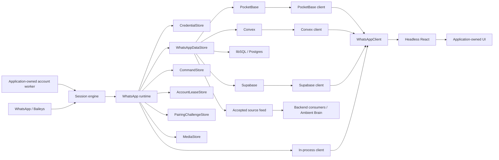

# WhatsApp application runtime, pluggable backends, and headless React

Status: historical target, superseded in part by accepted ADRs

Date: 2026-07-29

This document preserves the broader design that produced the accepted ADRs and
issue graph. It is not the current execution source of truth. The
[SDK capability catalogue](../sdk-capabilities.md) records the target product
surface. Its canonical [machine-readable source](../sdk-capabilities.json)
records Baileys availability, current whatsappd status, the target Client, and
plain verification status; accepted ADRs govern conflicts. In particular,
ADR-0023 moves synchronized application state from React into the
framework-independent Client. The package has already completed the hard cut
away from the Eve-era adapter, sidecar, and agent tools.

## Decision

`whatsappd` should become an application substrate for WhatsApp:

1. The existing session remains the live WhatsApp protocol engine.
2. A new runtime consumes one awaited typed-handler subscription, durably
   accepts normalized source batches, and projects a WhatsApp-native current
   mirror.
3. Optional backend packages provide credentials, accepted/current data,
   commands, protected pairing challenges, account leases, durable media,
   realtime delivery, migrations, and browser clients for PocketBase, Convex,
   libSQL, Postgres, and Supabase.
4. A backend-independent client contract feeds a headless React package.
5. Applications create the runtime inside a long-lived Node process. That
   application-owned process may be dedicated to one WhatsApp account, but
   `whatsappd` does not initially ship a generic daemon or HTTP transport.
6. Pairing is an account lifecycle command issued after account creation, not
   immutable runtime-constructor configuration.
7. `ChannelEvent`, `WhatsAppChannelAdapter`, the Eve adapter, the current
   webhook sidecar, and agent-specific tools leave the core product.
8. Stored database paging and on-demand WhatsApp history backfill are separate
   client operations.
9. The next package line is a hard cut: old streams, callbacks, aliases, and
   agent-era entry points receive no compatibility wrappers.

The important ownership boundary is:

> `whatsappd` owns WhatsApp state and the portable contracts for storing and
> consuming it. Applications own product policy built on top of that state.

That means PocketBase and Convex support are not handwritten separately in
every application. Their adapters, schemas, migrations, and conformance tests
belong to `whatsappd`. An application still owns its inbox admission,
retention, agent windows, search, knowledge extraction, and other product
semantics.

## The sidecar is retired

The current sidecar is an Eve-era HTTP webhook bridge over the reduced
`ChannelEvent` model. No inspected working application uses it as its WhatsApp
integration, and a dedicated operating-system process does not require a
generic daemon: application code can create the same runtime inside a
one-account worker process.

The sidecar package, wire protocol, and CLI are therefore removed rather than
renamed. A generic daemon or HTTP client transport can be proposed later if a
real non-Node or remote-process consumer proves that application-owned
composition and backend-native clients are insufficient.

## Architecture



The module boundaries are deliberately deeper than the current
channel/sidecar split:

| Module          | Owns                                                                                                                               | Does not own                                                  |
| --------------- | ---------------------------------------------------------------------------------------------------------------------------------- | ------------------------------------------------------------- |
| Session engine  | Baileys socket, credentials, reconnect, normalization, one awaited typed-handler subscription, live media handles, native commands | Databases, HTTP, React, PocketBase, Convex, agent frameworks  |
| Runtime         | Pairing, accepted-source ingestion, current projection, immediate media capture, commands, reconciliation, lifecycle, and leases   | Application identity, process supervision, product policy, UI |
| Backend package | Capability implementations, migrations, constraints, accepted-source reader, realtime client, access-rule templates                | The application’s identity model or product tables            |
| Client          | Snapshot-first reads, contiguous live patches, stored paging, history requests, commands, connection state                         | React, visual rendering, append-only product knowledge        |
| Headless React  | Provider, hooks, selectors, optimistic state, history/backfill behavior, render slots                                              | DOM, CSS, component library, backend SDK selection            |

## Why the current seams should not survive

The current code already contains a richer and better lower-level boundary:

- `src/session.ts` exposes connection, messages, conversation sync, updates,
  contacts, groups, presence, and native commands.
- `src/ports.ts` defines `CredentialStore`, which is specifically an opaque
  credential store.
- `src/channel/types.ts` reduces the system to message, update, and status
  events for Eve/Flue-style agent frameworks.
- `src/channel/adapter.ts` pumps only those three streams, does not await
  subscriber promises, and implements `markRead(chatId)` by inventing an empty
  message ID.
- `src/sidecar/server.ts` forwards those reduced events to webhook targets.
  Delivery failures are logged and discarded, and messages sent by the linked
  account are dropped.
- `src/sidecar/wire.ts` is consequently a lossy agent bridge rather than a
  complete WhatsApp client protocol.
- `package.json` still describes the package as an AI-agent channel and exports
  Eve, sidecar, and tools entry points.

`ChannelEvent` is therefore the wrong foundation for persistence or UI. It was
useful for a specific agent-framework integration, but it cannot represent the
state a WhatsApp client needs.

The replacement is not a larger `ChannelEvent`. It is a complete normalized
`WhatsAppEvent` emitted by the session engine and consumed by the runtime.

## Evidence from existing applications

The local applications do not establish the current sidecar as the reusable
architecture:

| Application      | Observed integration                                                                                                                             | Consequence                                                                                            |
| ---------------- | ------------------------------------------------------------------------------------------------------------------------------------------------ | ------------------------------------------------------------------------------------------------------ |
| Ambient Agent    | Creates `WhatsAppSession` in-process and projects it into its own archive before Flue dispatch                                                   | The socket/runtime can be embedded; Flue is downstream product policy                                  |
| Ambient Agent v3 | Its disposable spike uses six old callbacks, writes a raw PocketBase corpus, and eagerly stores media; the planned Brain is not implemented      | PocketBase and immediate media are proven needs; production waits for a published accepted-source feed |
| Open Coworker    | Its design explicitly embeds the WhatsApp supervisor in the long-lived Hono server                                                               | Useful donor for UI and supervision, but deprecated as a destination                                   |
| Twinin           | Has an app-specific “sidecar” composition that does not yet open Baileys sockets, while its current live path is in-process and writes to Convex | Convex needs an adapter; this does not validate the existing `whatsappd/sidecar`                       |
| ok-sync          | Describes a possible future separate process but does not currently consume `whatsappd` that way                                                 | Future topology is not a reason to hard-code sidecar ownership now                                     |

The common denominator is a long-lived runtime plus a durable projection, not
Eve, Flue, webhooks, or a mandatory second process.

## Core session boundary

`createSession()` remains usable by consumers that need only the current
low-level live connection API:

```ts
const session = createSession({
  auth: qrAuth(),
  store: fileCredentialStore("./data/whatsapp-auth"),
});

const unsubscribe = session.subscribe(
  {
    connection(status) {
      renderStatus(status);
    },

    message: async (message, { reply }) => {
      await acceptMessage(message);
      if (shouldReply(message)) await reply("Got it");
    },

    update: async (update) => {
      await acceptUpdate(update);
    },
  },
  { signal },
);

await session.start();
```

`subscribe()` is the only public live-consumption shape. A consumer supplies any
subset of typed handlers in one registration and receives one cleanup handle.
The dispatcher awaits every matching asynchronous handler across subscriptions
before accepting the next normalized event. A rejected handler fails the
processing pipeline; persistence failures are not observability warnings.

The seven per-category streams, seven `onX` methods, public event iterator, and
bound `IncomingMessage.reply` shape are removed in the new package line without
compatibility wrappers. The internal ordered `WhatsAppEvent` union still exists
for normalization and durable source records.

The durable runtime does not require a phone number or pairing method at
construction:

```ts
const backend = pocketBaseBackend({
  client: adminPocketBase,
  accountId: "personal",
});

const whatsapp = createWhatsAppRuntime({
  accountId: "personal",
  backend,
});

await whatsapp.start();
```

`start()` resumes when credentials already exist and otherwise reports that the
account needs pairing. The application can then choose either method at
runtime:

```ts
// Pairing-code UI:
const challenge = await whatsapp.pair({
  method: "pairing_code",
  phoneE164: phoneCollectedFromTheUser,
});

// Or QR UI:
const qr = await whatsapp.pair({ method: "qr" });
```

The phone is validated when the pairing command crosses the runtime boundary.
It is neither an environment-only value nor permanent account configuration.
Pairing is rejected once usable credentials exist unless the account is
explicitly unlinked first.

One backend factory may provide all capabilities over one configured
connection, but the capabilities stay logically separate and independently
replaceable:

```ts
const whatsapp = createWhatsAppRuntime({
  accountId: "personal",
  backend: {
    credentials: libsqlCredentialStore({
      client: localDatabase,
      accountId: "personal",
    }),
    data: pocketBaseDataStore({
      client: adminPocketBase,
    }),
    commands: pocketBaseCommandStore({
      client: adminPocketBase,
    }),
    leases: pocketBaseLeaseStore({
      client: adminPocketBase,
    }),
    pairingChallenges: pocketBasePairingChallengeStore({
      client: adminPocketBase,
    }),
    media: pocketBaseMediaStore({
      client: adminPocketBase,
    }),
  },
});
```

This supports “use PocketBase here, Convex there, libSQL locally” without
making applications implement WhatsApp persistence themselves.

## Credentials and WhatsApp data are separate capabilities

The former `SessionStore` contract is `CredentialStore` in the hard-cut release:

```ts
export interface CredentialStore {
  read(key: string): Promise<string | null>;
  write(entries: Record<string, string | null>): Promise<void>;
  clear(): Promise<void>;
}
```

Durable WhatsApp state has different invariants:

The sketches below predate ADR-0018, which splits the source cursor from the
mirror revision and passes the writer's fencing token into acceptance. They also
show an `accountId` and an `eventId` on `WhatsAppDataEvent` that the shipped
contract does not carry — the `accept()` call is the only scope, and no observation
identity exists until something retries. `AccountLease.fencingToken` is a
`number`, not the `string` the lease sketch shows: a store deciding whether a
writer has been superseded compares tokens, and string order ranks claim 10
below claim 9 (ADR-0018). ADR-0022 adds the first delete: consolidation of a
redundant current contact after WhatsApp delivers equivalent address forms.
Read `src/runtime/contracts.ts` for the shipped shapes.

```ts
export interface AcceptedWhatsAppBatch {
  readonly accountId: string;
  readonly fromRevision: number;
  readonly revision: number;
  readonly events: readonly WhatsAppDataEvent[];
  readonly patch: WhatsAppPatch;
}

export interface StoredMessageCursor {
  readonly timestamp: number;
  readonly messageId: string;
}

export interface StoredMessagePage {
  readonly items: readonly MessageRecord[];
  readonly next?: StoredMessageCursor;
}

export interface WhatsAppDataStore {
  accept(accountId: string, events: readonly WhatsAppDataEvent[]): Promise<AcceptedWhatsAppBatch>;

  snapshot(accountId: string): Promise<WhatsAppSnapshot>;

  messages(
    accountId: string,
    chatId: string,
    page: { before?: StoredMessageCursor; limit: number },
  ): Promise<StoredMessagePage>;

  followAccepted(
    accountId: string,
    options: { afterRevision: number; signal?: AbortSignal },
  ): AsyncIterable<AcceptedWhatsAppBatch>;
}
```

`accept()` appends the normalized source batch, projects it into the current
mirror, and stamps the account’s next revision in one backend transaction.
`followAccepted()` is the durable backend-consumer boundary for systems such as
Ambient Brain. Snapshots contain summaries, while active-chat history is served
through stored `messages()` pages.

They must not be collapsed into one store because:

- credentials are opaque Signal/Baileys secrets;
- client data is structured and queryable;
- credential `clear()` is called on terminal logout and must not erase chats;
- credentials must never cross a browser boundary;
- backup, encryption, migration, and retention policies differ;
- a live session requires credentials but not a durable client mirror;
- an application may intentionally mix physical backends.

A convenience backend groups capabilities; it does not erase their boundaries:

```ts
export interface WhatsAppBackend {
  readonly credentials: CredentialStore;
  readonly data: WhatsAppDataStore;
  readonly commands: WhatsAppCommandStore;
  readonly leases: AccountLeaseStore;
  readonly pairingChallenges: PairingChallengeStore;
  readonly media: MediaStore;
}
```

The lease capability is required, not a deployment option. `start()` acquires
the account lease before opening Baileys and heartbeats it for the life of the
session; acquisition failure rejects with `AccountAlreadyClaimedError`, and a
lost lease closes the socket. Two live sockets on one account diverge Signal
ratchet state and can corrupt credentials, so a double-start must fail closed
rather than race. The memory backend ships an in-process lease store for tests
and single-process composition.

Lease acquisition uses backend time, a TTL, and a monotonically increasing
fencing token. PocketBase requires a server-side transaction, Convex an atomic
mutation on the canonical account document, and SQL a conditional upsert.
Client-side read-then-update is not a valid adapter implementation.

```ts
export interface AccountLease {
  readonly accountId: string;
  readonly holderId: string;
  readonly fencingToken: string;
  readonly expiresAt: number;
}

export interface AccountLeaseStore {
  acquire(
    accountId: string,
    holderId: string,
    ttlMs: number,
  ): Promise<{ acquired: true; lease: AccountLease } | { acquired: false; heldUntil: number }>;

  renew(
    lease: AccountLease,
    ttlMs: number,
  ): Promise<
    { renewed: true; lease: AccountLease } | { renewed: false; reason: "lost" | "expired" }
  >;

  release(lease: AccountLease): Promise<boolean>;
}
```

Remote credential adapters should require host-side encryption material or an
equivalent trusted secret-store integration. A browser-authenticated backend
client must never be sufficient to read WhatsApp device credentials.

## Ordered normalization and typed live subscription

The session normalizes one internal ordered event union:

```ts
export type ConversationSyncSource =
  | "initial_bootstrap"
  | "recent"
  | "on_demand"
  | "full"
  | "unknown";

export interface ConversationSyncContext {
  readonly source: ConversationSyncSource;
  readonly isLatest?: boolean;
  readonly chunkOrder?: number;
  readonly progress?: number;
  readonly requestSessionId?: string;
  readonly projection:
    | { readonly mode: "upsert" }
    | {
        readonly mode: "authoritative_replacement";
        readonly scope: "account" | { readonly chatId: string };
      };
}

export interface ConversationSyncBatch {
  readonly context: ConversationSyncContext;
  readonly chats: readonly HistoryChat[];
  readonly contacts: readonly HistoryContact[];
  readonly self?: HistoryContact;
  readonly messages: readonly InboundMessage[];
}

export type WhatsAppEvent =
  | { type: "connection"; status: Status }
  | { type: "conversation_sync"; batch: ConversationSyncBatch }
  | { type: "message"; message: InboundMessage }
  | { type: "update"; update: Update }
  | { type: "contact"; contact: ContactUpdate }
  | { type: "group"; group: GroupUpdate }
  | { type: "presence"; presence: PresenceUpdate };
```

Applications do not consume that union through a public iterator. They register
one typed handler map:

```ts
type Awaitable<T> = T | Promise<T>;

export interface WhatsAppSessionHandlers {
  connection?(status: Status): Awaitable<void>;
  conversationSync?(batch: ConversationSyncBatch): Awaitable<void>;
  message?(
    message: InboundMessage,
    actions: {
      reply(content: Outbound | string, options?: SendOptions): Promise<MessageRef>;
    },
  ): Awaitable<void>;
  update?(update: Update): Awaitable<void>;
  contact?(contact: ContactUpdate): Awaitable<void>;
  group?(group: GroupUpdate): Awaitable<void>;
  presence?(presence: PresenceUpdate): Awaitable<void>;
}

export interface WhatsAppSession {
  subscribe(handlers: WhatsAppSessionHandlers, options?: { signal?: AbortSignal }): Unsubscribe;
}
```

The dispatcher performs one property lookup per subscription and event, awaits
all matching handlers, and only then advances. This retains narrow callback DX,
provides real backpressure, avoids seven independent buffers, and makes
completion deterministic in tests. Observability hooks that must never affect
the connection remain explicit fire-and-forget configuration, not subscribers.

### Public session API decision rubric

Scores use 1 (materially fails) through 5 (directly satisfies). Correctness and
testability are gates: an option below 4 on either is rejected regardless of
the other scores.

| Option                            | Correctness / integrity | Testability | Public DX | Performance / backpressure | One-way API fit |
| --------------------------------- | ----------------------- | ----------- | --------- | -------------------------- | --------------- |
| Seven rebuilt `onX` methods       | 4                       | 4           | 5         | 4                          | 3               |
| Typed `subscribe({ handlers })`   | 5                       | 5           | 5         | 5                          | 5               |
| Typed `on("message", handler)`    | 4                       | 4           | 5         | 4                          | 4               |
| Public async iterable event union | 5                       | 3           | 3         | 5                          | 4               |

| Option                            | Floor-first | Reversibility | Blast-radius containment | Parallelizability | Fit with current code |
| --------------------------------- | ----------- | ------------- | ------------------------ | ----------------- | --------------------- |
| Seven rebuilt `onX` methods       | 4           | 4             | 3                        | 4                 | 5                     |
| Typed `subscribe({ handlers })`   | 5           | 4             | 4                        | 5                 | 5                     |
| Typed `on("message", handler)`    | 4           | 4             | 4                        | 4                 | 4                     |
| Public async iterable event union | 4           | 4             | 3                        | 4                 | 4                     |

The handler map wins because it retains narrow callback types and one cleanup
handle while making awaited completion, cross-category order, and deterministic
test emission part of one contract. EventEmitter naming was rejected because
its conventional fire-and-forget semantics contradict this backpressure.

Connection and presence are ordered live signals, not durable source inputs.
The runtime maps the remaining handler arms into account-scoped source events:

```ts
export type WhatsAppDurableEvent = Exclude<WhatsAppEvent, { type: "connection" | "presence" }>;

export interface WhatsAppDataEvent {
  readonly accountId: string;
  readonly eventId: string;
  readonly observedAt: number;
  readonly event: WhatsAppDurableEvent;
}
```

Persisting and replaying “typing”, `online`, or a pairing challenge would
manufacture false current state. A backend may publish connection state for
remote clients only with the current lease holder, fencing token, observation
time, and expiry. Clients treat an expired record or lease mismatch as
unavailable and never hydrate the last stored status as current. Durable
account lifecycle facts such as `needs_pairing` and terminal suspension remain
in `runtime_state`; ephemeral socket phase does not.

For each durable event, the runtime first captures media when present, then
calls `data.accept()`. The backend transaction appends the source batch,
projects the mirror, stamps the next revision, and returns the client patch:

```ts
async function accept(event: WhatsAppDataEvent): Promise<void> {
  const durableEvent = await captureMedia(event, media);
  const accepted = await data.accept(accountId, [durableEvent]);
  publish(accepted.patch);
}
```

This is a semantic requirement:

- a failed write is observable;
- the event is not reported to clients as durably accepted;
- a webhook-style “log and discard” path is not allowed.

Failed acceptance is retried in place with capped exponential backoff and
visible degraded state; exhaustion stops the socket rather than skipping the
event. Retries and degraded state do not exist yet: today the first failure
stops the runtime with the original error, and a `closed` frame carries it to
every watcher. Retrying cannot be added before an observation identity exists to
tell a retry from a genuine repeat delivery (ADR-0018). Once accepted, source
batches survive process replacement and backend consumers resume from their own
revision cursor. ADR-0025 accepts the narrow pre-acceptance boundary—after
protocol delivery but before the backend transaction—as unproven for 0.3. The
Runtime makes no lossless-delivery or replay claim there.

## Canonical durable mirror

The current mirror represents current WhatsApp state. Accepted source batches
retain the ordered normalized inputs needed by durable backend consumers; they
are not application beliefs, archives, or UI patches. The portable domain model
is:

```text
credentials                 server-only, separate lifecycle

accepted_source_batches     durable normalized source inputs + revision
accounts
chats
contacts
groups
group_members
messages
message_reactions
message_receipts
media                       metadata, durable opaque ref, capture state
commands
command_attempts
runtime_state               revision, durable lifecycle, sync checkpoint, last error
pairing_challenges           protected short-lived secret capability
account_leases              single-writer claims, always present
```

All durable records are explicitly account-scoped. No adapter may infer
`accountId` from insertion order, a message ID, the current process, or a
backend user.

At minimum, adapters enforce equivalent identities:

```text
chat:         (account_id, chat_id)
contact:      (account_id, contact_id)
group:        (account_id, group_id)
participant:  (account_id, group_id, participant_id)
message:      (account_id, chat_id, message_id)
reaction:     (account_id, chat_id, message_id, actor_id)
receipt:      (account_id, chat_id, message_id, receipt_subject)
command:      (account_id, client_command_id)
```

`receipt_subject` is always non-null. A participant receipt uses
`participant:<canonical WhatsApp address>`; the actorless status emitted by an
ordinary direct-chat `messages.update` uses the reserved value `aggregate`.
Receipt status is projected data, not part of the identity, so replay advances
one current receipt instead of inserting another row. SQL adapters enforce this
with a non-null column and a compound unique constraint rather than relying on
nullable uniqueness.

Message edits and revocations update the current message projection. Their
distinct normalized inputs remain in accepted source batches so systems such as
Ambient Brain can append separate observations without treating the mirror as
an archive.

Conversation sync is an upsert, not an unconditional replacement:

- a returning linked session may emit zero history batches;
- zero batches must preserve the previous snapshot;
- the normalizer retains source, `isLatest`, chunk order, progress, and request
  session metadata instead of discarding them;
- `isLatest` or `progress === 100` alone never implies replacement;
- records are removed only when WhatsApp emits a definite removal/revocation or
  the normalizer emits an explicitly proven
  `projection.mode === "authoritative_replacement"` with a bounded scope;
- until live protocol proof establishes such a mapping, every conversation
  sync batch uses `projection.mode === "upsert"`;
- replaying the same message, update, contact, or group event is idempotent.

## Media boundary

The current `MediaHandle` contains a live `download()` closure that cannot
survive JSON serialization or a process restart. The runtime therefore starts
capture for every inbound image, video, audio, document, and sticker while that
handle can still decrypt or request re-upload.

```ts
export interface MediaStore {
  put(input: {
    accountId: string;
    message: MessageRef;
    kind: "image" | "video" | "audio" | "document" | "sticker";
    bytes: Uint8Array;
    mimetype?: string;
  }): Promise<{ ref: string; byteLength: number }>;
}

export type MediaRecord =
  | {
      state: "stored";
      ref: string;
      byteLength: number;
      meta: MediaMeta;
    }
  | {
      state: "failed";
      error: string;
      meta: MediaMeta;
    };
```

The media store is required by the durable runtime and independently
replaceable from structured data. PocketBase uses protected files; Convex uses
storage; Supabase uses Storage; local SQL composition supplies a durable
filesystem/blob implementation. Blob writes use idempotent account/message keys
and orphan cleanup because blob storage and database transactions cannot be
made one portable atomic operation.

Voice-note transcription is a derived consumer loop over stored audio
(`kind: "audio"` and `ptt: true`). A transcript is a separate artifact or
observation; failure never removes or downgrades the stored raw audio.

## Commands and optimistic reconciliation

The client must expose WhatsApp commands, not agent tools:

```ts
export type WhatsAppCommand =
  | SendMessageCommand
  | MarkReadCommand
  | SetTypingCommand
  | ReactCommand
  | EditMessageCommand
  | RevokeMessageCommand
  | RequestHistoryCommand
  | PairCommand
  | UnlinkCommand;
```

Account lifecycle rides the same queue. `PairCommand` carries the method and,
for pairing codes, the dynamically supplied phone number; the runtime executes
it and writes only challenge identifier, method, state, and expiry into
`runtime_state`. The raw QR or pairing code is returned through an authorized,
short-lived `PairingChallengeStore`; it never enters ordinary snapshots,
subscriptions, backups, or diagnostic dumps.

`UnlinkCommand` performs a Baileys logout so the phone forgets the device,
clears that account’s credentials, and sets `runtime_state` to `needs_pairing`;
the mirror is retained. The worker-local `runtime.pair()` remains for bootstrap
and CLI composition — the queue is the authorized browser path, not a
replacement for it. Because linking is the most privileged account operation,
application authorization rules may distinguish lifecycle commands from chat
commands, but both flow through the same application-authorization surface.

```ts
export interface PairingChallengeStore {
  publish(input: {
    accountId: string;
    challengeId: string;
    encryptedSecret: Uint8Array;
    expiresAt: number;
  }): Promise<void>;

  consume(accountId: string, challengeId: string): Promise<string | undefined>;

  clear(accountId: string, challengeId: string): Promise<void>;
}
```

`RequestHistoryCommand` carries one chat and the oldest stored WhatsApp message
key plus timestamp. Its count is validated at the protocol maximum of 50. The
command receipt proves submission, not delivery or exhaustion; later accepted
history batches update the mirror and request state as far as live Baileys
correlation proof permits.

`MarkReadCommand` carries real message references. It must not repeat the
current channel adapter’s empty-message-ID shortcut.

Backends with browser-accessible mutations use a durable command queue:

```ts
export interface WhatsAppCommandStore {
  submit(accountId: string, command: WhatsAppCommand): Promise<WhatsAppCommandReceipt>;

  take(
    accountId: string,
    options?: { signal?: AbortSignal },
  ): AsyncIterable<ClaimedWhatsAppCommand>;

  startAttempt(
    accountId: string,
    commandId: string,
    claimId: string,
  ): Promise<{ started: true } | { started: false; reason: "lost" | "expired" }>;

  complete(
    accountId: string,
    commandId: string,
    claimId: string,
    result: WhatsAppCommandResult,
  ): Promise<void>;
}
```

The runtime is the only component that executes these commands against the
session. Command state is:

```text
pending -> claimed (leased) -> executing -> succeeded | failed | outcome_unknown
              | expired before execution
              +-------------------------> pending
executing lease expires ----------------> outcome_unknown
```

Each submission has an application-generated idempotency key. Transport
retries may safely return the same receipt, but WhatsApp command execution is
not transparently retried after an ambiguous socket failure. Claims use backend
time, an attempt identifier, and a short lease. Expiry before `startAttempt()`
may safely return the command to pending; expiry after execution begins writes
the terminal `outcome_unknown` result. A replacement worker cannot claim that
attempt again. The client may offer an explicit new command, but it must show
that the prior outcome is unknown because retrying `sendMessage` can duplicate
a real message.

The client may show an optimistic message keyed by `clientCommandId`. The
runtime reconciles it with the authoritative outbound message echo or command
result, then replaces or marks the optimistic record.

## Backend-independent client

React and application code consume one contract:

```ts
export interface WhatsAppClient {
  watch(options?: {
    accountId?: string;
    signal?: AbortSignal;
  }): AsyncIterable<
    | { type: "snapshot"; snapshot: WhatsAppSnapshot }
    | { type: "patch"; patch: WhatsAppPatch }
    | { type: "presence"; presence: PresenceUpdate }
    | { type: "connection"; state: WhatsAppClientConnectionState }
  >;

  messages(
    chatId: string,
    page: { before?: StoredMessageCursor; limit: number },
  ): Promise<StoredMessagePage>;

  requestHistory(
    input: {
      chatId: string;
      before: MessageRef & { timestamp: number };
      count?: number;
    },
    options?: { signal?: AbortSignal },
  ): Promise<WhatsAppCommandReceipt>;

  execute(
    command: WhatsAppCommand,
    options?: { signal?: AbortSignal },
  ): Promise<WhatsAppCommandReceipt>;
}
```

The snapshot contains the account, chat summaries (including last-message
preview), contacts, and groups. It contains no message window for every chat.
Opening an active conversation calls `messages()` for its first stored page;
further stored pages remain deterministic backend reads.

An exhausted stored cursor means only that no older messages are currently in
the mirror. `requestHistory()` separately asks WhatsApp for older messages and
may expose “requesting”, “request sent”, “new messages stored”, or “failed”. It
does not expose “all history loaded” or “no more WhatsApp messages” without the
blocked live protocol proof.

```ts
export type OlderHistoryState =
  | { state: "showing_saved_messages" }
  | { state: "no_older_saved_messages"; canRequest: boolean }
  | { state: "requesting_from_linked_phone" }
  | { state: "request_sent"; requestId: string }
  | { state: "new_messages_saved"; count: number }
  | { state: "request_failed"; message: string };
```

Every `watch()` starts with a store-backed snapshot. Live patches delivered
after it are ordered after that snapshot by revision, not by heuristics:

```ts
export interface WhatsAppPatch {
  readonly accountId: string;
  readonly fromRevision: number;
  readonly revision: number;
  readonly upserts: readonly MirrorRecord[];
  readonly deletes: readonly MirrorRecordKey[];
}
```

Patches carry normalized mirror records, not WhatsApp events: projection logic
runs once, server-side, in the runtime. A client applies a patch only when
`patch.fromRevision` exactly equals its current revision. Stale patches are
ignored; a future base is a gap and triggers a fresh snapshot. The contract owns
that race and recovery; React components do not.

On reconnect, the UI client receives a fresh snapshot. Durable backend
consumers do not use UI snapshots: they follow accepted source batches through
the backend package from their own revision cursor.

Concrete clients are:

```ts
createInProcessWhatsAppClient(runtime)
createPocketBaseWhatsAppClient({ client: authenticatedPocketBase })
createConvexWhatsAppClient({ client: authenticatedConvex })
createSupabaseWhatsAppClient({ client: authenticatedSupabase })
createMemoryWhatsAppClient(...)
```

The backend client is chosen once at the application composition root. The UI
does not contain `if (pocketbase)` or backend-specific query code. A future
remote transport can implement the same contract without changing React, but
it is not part of the initial package family.

## Headless React

`@whatsappd/react` owns state synchronization and interaction behavior, not
markup or styling. It does not reimplement generic transcript scrolling.

The preferred proof consumer composes the package with shadcn's general chat
components. `@shadcn/react/message-scroller` owns anchored turns, live-edge
following, prepend preservation, jumping, and visibility. Application-owned
registry components such as `Message`, `Bubble`, `Attachment`, and `Marker`
own DOM and presentation. They explicitly do not own messages, transport,
persistence, or model state, so their boundary matches `WhatsAppClient`.

`@whatsappd/react` does not take a hard shadcn dependency. It supplies stable
message identities, saved-page actions, explicit WhatsApp-backfill state,
selectors, commands, and render slots that compose naturally with those
primitives. An official proof application demonstrates the integration. AI
Elements remain suitable for model-streaming views, but WhatsApp records are
not converted into AI SDK roles or message parts merely to use them.

```tsx
const client = createPocketBaseWhatsAppClient({
  client: authenticatedPocketBaseClient,
});

<WhatsAppProvider client={client}>
  <Conversation.Root chatId={chatId}>
    <Conversation.Messages>
      {({ messages, status, loadOlderSaved, requestOlderFromWhatsApp, historyState }) => (
        <MyMessageList
          messages={messages}
          status={status}
          historyState={historyState}
          onLoadOlderSaved={loadOlderSaved}
          onRequestBackfill={requestOlderFromWhatsApp}
        />
      )}
    </Conversation.Messages>

    <Conversation.Typing>
      {({ participants }) => <MyTypingIndicator people={participants} />}
    </Conversation.Typing>

    <Conversation.Composer>
      {({ draft, setDraft, submit, pending, error }) => (
        <MyComposer
          value={draft.text}
          onChange={(text) => setDraft({ text })}
          onSubmit={submit}
          pending={pending}
          error={error}
        />
      )}
    </Conversation.Composer>
  </Conversation.Root>
</WhatsAppProvider>;
```

The package also exposes hooks for applications that do not want compound
components:

```ts
useWhatsAppConnection();
useWhatsAppAccounts();
useChats();
useChat(chatId);
useMessages(chatId);
usePresence(chatId);
useComposer(chatId);
useWhatsAppCommand();
```

The framework-independent Client owns:

- snapshot hydration and patch application;
- gap detection and fresh-snapshot recovery;
- active-chat stored paging and explicit WhatsApp backfill state;
- optimistic command state and reconciliation;
- typing expiry;
- read-receipt batching with real message references;
- reconnect and stale-state handling.

The React provider owns one Client subscription, React selectors and structural
sharing, stable callbacks, and aborting React work on unmount. It does not
implement a second synchronization state machine.

The provider does not render a `div`, ship CSS, require Tailwind, assume a
component library, or imitate WhatsApp’s visual design. Open Coworker can donate
interaction and information-architecture lessons, but it is not a package
dependency or the new product foundation.

### Browser proof and database oracle

The React package is not accepted by typechecking hooks or rendering isolated
stories. One committed proof application composes deterministic and real
PocketBase or Convex clients through the same provider, hooks, render slots, and
shadcn chat presentation.

An AI drives that application at fixed desktop and mobile viewports to prove:

- snapshot hydration and database-consistent message order;
- saved-page prepend without moving the visible message;
- live messages arriving without stealing a reader's scroll position;
- honest separation of saved-page exhaustion and WhatsApp backfill;
- stored and failed media states;
- optimistic command reconciliation without duplication;
- typing expiry, reconnect, degraded state, and revision-gap replacement;
- keyboard behavior, accessible names, console health, and network health.

Each run retains semantic and interaction assertions plus privacy-safe
screenshots. A screenshot alone is not acceptance.

For durable or backend-backed claims, a read-only Database Oracle generates
sanitized stable identities, timestamps, revisions, counts, and hashes. Public
client or browser behavior is asserted first and cross-checked against that
manifest second. Component tests never use direct database queries as their
primary seam, and personal message bodies, native addresses, media, pairing
secrets, and credentials never enter published evidence.

## Backend packages

The initial public package family is limited to working vertical slices:

```text
whatsappd
@whatsappd/react
@whatsappd/pocketbase
```

`@whatsappd/convex` is added when the Convex vertical slice begins. libSQL,
Postgres, Supabase, and standalone testing packages are published only when
their complete adapter surfaces have real consumers; empty placeholder packages
are not shipped. Deterministic core session test support ships from the
`whatsappd/testing` subpath rather than creating another package.

Releases use the installed Changesets flow with a fixed (lockstep) group:
`whatsappd` and every `@whatsappd/*` package share one version and release
together, so no compatibility matrix exists while the contracts are young.
The publish workflow iterates the workspace with per-package
skip-if-published and npm provenance. The group can be unfixed later when the
contracts stabilize.

`whatsappd` contains the session, runtime, domain contracts, and in-process
client. Backend SDKs and React do not enter its default dependency graph.

Each backend package may expose server and client subpaths:

```text
@whatsappd/pocketbase/server
@whatsappd/pocketbase/client
@whatsappd/pocketbase/migrations

@whatsappd/convex/server
@whatsappd/convex/client
@whatsappd/convex/component
```

Old aliases and agent-era subpaths are retired rather than carried into the new
architecture:

```text
SessionStore
whatsappd/stores/memory
whatsappd/stores/libsql
whatsappd/adapters/eve
whatsappd/sidecar
whatsappd/tools
```

If a real consumer still needs AI-framework tool wrappers, they can later live
in a separate `@whatsappd/ai` package built on `WhatsAppClient.execute()`.
There is no reason to keep them in the core speculatively.

## PocketBase adapter

PocketBase is the first complete backend because Ambient Agent v3 is already a
real consumer:

- [`ambient-agent-v3#1`](https://github.com/AaronAbuUsama/ambient-agent-v3/issues/1)
  requires PocketBase-backed WhatsApp credentials;
- [`ambient-agent-v3#2`](https://github.com/AaronAbuUsama/ambient-agent-v3/issues/2)
  requires account-scoped message, chat, contact, and account views.

The package supplies:

```ts
const backend = pocketBaseBackend({
  client: adminPocketBase,
  accountId: "personal",
  prefix: "whatsappd",
});

const client = createPocketBaseWhatsAppClient({
  client: authenticatedPocketBaseClient,
  accountId: "personal",
});
```

It also exposes the capabilities independently:

```ts
pocketBaseCredentialStore(...)
pocketBaseDataStore(...)
pocketBaseCommandStore(...)
pocketBaseLeaseStore(...)
pocketBasePairingChallengeStore(...)
pocketBaseMediaStore(...)
pocketBaseAcceptedSource(...)
```

The server adapter uses privileged account-worker credentials. The browser
client uses an already-authenticated application client.

Default collections are conceptually:

```text
whatsappd_credentials
whatsappd_accepted_source_batches
whatsappd_accounts
whatsappd_chats
whatsappd_contacts
whatsappd_groups
whatsappd_group_members
whatsappd_messages
whatsappd_message_reactions
whatsappd_message_receipts
whatsappd_media
whatsappd_commands
whatsappd_command_attempts
whatsappd_runtime_state
whatsappd_pairing_challenges
whatsappd_account_leases
```

Requirements:

- credential rules are locked to privileged server access;
- every data record is explicitly account-scoped;
- account/chat/message and related identities have unique indexes;
- writes are idempotent upserts;
- multi-record mutations use PocketBase’s transactional batch API or a
  server-side transaction;
- accepted source append, mirror projection, and revision increment share one
  server-side transaction;
- the accepted-source reader is service-authorized and cursor-resumable;
- migrations are versioned, inspectable, and committed;
- collection prefix is configurable without leaking collection names into the
  domain contract;
- realtime subscriptions obey collection access rules;
- credential `clear()` affects only one account’s credential rows;
- protected media files are not exposed by public URLs;
- raw pairing challenges are protected separately from ordinary runtime-state
  reads and expire promptly.

PocketBase View collections may provide backend-native derived read models, but
the portable client and store contracts do not expose PocketBase collection or
filter syntax.

PocketBase provides versioned JavaScript migrations, collection API rules, and
a batch records API. Those native features should be used rather than building
a generic migration or authorization layer:

- [PocketBase JavaScript migrations](https://pocketbase.io/docs/js-migrations/)
- [PocketBase API rules and filters](https://pocketbase.io/docs/api-rules-and-filters/)
- [PocketBase records and batch API](https://pocketbase.io/docs/api-records/)

The default access template may use an owner relation from
`whatsappd_accounts` to a configured PocketBase auth collection. Team or
organization applications can replace that rule template with their own
membership relation. `whatsappd` supplies secure rules and fields; it does not
decide which application users belong to an account.

The current v3 spike remains evidence and fixture material, not the production
schema. It writes a raw event collection with fire-and-forget callbacks and
filesystem credentials. Ambient production integration blocks on the published
whatsappd release, then follows accepted source batches with a Brain-owned
cursor. It does not reconstruct observations from mirror patches or copy
unpublished contracts.

## Convex adapter

Convex is a first-class peer of PocketBase, not an application-specific
projection. Baileys never runs inside a Convex function: a long-lived
application-owned Node worker owns the socket and calls the Convex deployment
through its JavaScript client.

The installed component owns the durable schema and functions:

```ts
// convex/convex.config.ts
import whatsappd from "@whatsappd/convex/component";

app.use(whatsappd);
```

The external worker composes the runtime with the server adapter:

```ts
// Long-lived Node process, not a Convex function.
const backend = convexBackend({
  accountId: "personal",
  client: serviceAuthenticatedConvexClient,
  api: api.whatsappService,
});

const whatsapp = createWhatsAppRuntime({
  accountId: "personal",
  backend,
});

await whatsapp.start();
```

`api.whatsappService` is application-mounted server glue. It verifies the
worker’s service credential, then calls the component:

```ts
export const ingest = mutation({
  args: serviceIngestArgs,
  handler: async (ctx, args) => {
    await requireWhatsAppWorker(ctx, args.serviceToken, args.accountId);
    return ctx.runMutation(components.whatsappd.ingest, args.event);
  },
});
```

The browser uses the ordinary authenticated Convex React client:

```ts
const client = createConvexWhatsAppClient({
  client: authenticatedConvexReactClient,
  api: api.whatsapp,
  accountId: "personal",
});
```

The worker writes normalized events through Convex mutations and uses a
long-lived Convex subscription to receive pending commands for its account. It
executes each command against Baileys, then records the result and authoritative
outbound echo through another mutation. Convex owns transactions, queries,
command records, and the current mirror; it does not own the socket lifecycle.

Convex queries are reactive and consistent, so the browser adapter translates
native query updates into `WhatsAppClient` snapshots and revisioned
record-upsert patches instead of implementing a second websocket protocol. `@whatsappd/react` therefore works
unchanged: it consumes `WhatsAppClient`, not the worker process.

Convex components do not directly receive the parent application’s auth
context. The package therefore supplies application-side query/mutation
wrappers that authenticate with the host app and pass an authorized principal
or account scope into the component. It must not pretend that installing a
component automatically defines the app’s user-to-account policy.

The external worker authenticates as a service, not as an application user.
Its credential and mutation functions validate that service boundary and are
never re-exported to browser clients. WhatsApp device credentials are encrypted
before storage and can be read only through that service-authorized path.

Relevant native facilities:

- [Convex components](https://docs.convex.dev/components/understanding)
- [Authoring components and their authentication boundary](https://docs.convex.dev/components/authoring)
- [Convex realtime queries](https://docs.convex.dev/realtime)

## libSQL and plain Postgres adapters

libSQL is the SQL reference because the repository already ships a credential
adapter and already has an optional `@libsql/client` dependency.

The existing credential table is migration input for the renamed credential
capability; the old import path is not preserved:

```sql
CREATE TABLE wa_auth (
  account TEXT NOT NULL,
  key TEXT NOT NULL,
  value TEXT NOT NULL,
  PRIMARY KEY (account, key)
)
```

The libSQL package:

- preserves the current account-scoped `wa_auth` behavior;
- exposes `libsqlCredentialStore(...)`, `libsqlDataStore(...)`, and
  `libsqlCommandStore(...)` independently; `libsqlBackend(...)` also requires
  lease, protected challenge, and durable filesystem/blob media capabilities;
- adds versioned client-data migrations;
- uses database constraints for canonical identities;
- appends accepted source batches, applies their projections, and increments
  revision in a transaction;
- reconstructs the same `WhatsAppSnapshot` as PocketBase;
- supports separate database clients for credentials and data;
- does not claim to provide application authentication or browser-safe
  realtime.

Plain Postgres follows the same server-side contract once there is a concrete
consumer. It does not require a generic ORM, collection abstraction, or
database-agnostic query language.

libSQL and plain Postgres do not automatically provide a browser-safe client or
application authentication. Their first adapters are therefore server-side
only. An application may expose its own authorized routes over
`WhatsAppClient`; a reusable HTTP transport remains deferred until a real
consumer proves that repeated application glue warrants another public
package.

## Supabase adapter

Supabase is a Postgres deployment with a meaningful additional client
capability: Auth, browser data access, storage, and realtime.

The server adapter uses a trusted server client. The browser adapter accepts an
already-authenticated Supabase client. Shipped SQL migrations enable RLS on
every exposed table and include owner-scoped policy templates. Applications
with organization membership replace or extend those templates.

Supabase Auth and RLS remain native:

- [Supabase Auth](https://supabase.com/docs/guides/auth)
- [Supabase row-level security](https://supabase.com/docs/guides/database/postgres/row-level-security)
- [Supabase Realtime](https://supabase.com/docs/guides/realtime/getting_started)

The service role key and WhatsApp credentials never enter browser bundles.

## Authentication ownership

There are three distinct identities:

1. WhatsApp device credentials used by the account worker to maintain the
   linked device.
2. Backend service credentials used by the runtime to mutate the mirror.
3. Application user identity used by a browser to read accounts and submit
   commands.

They must not be conflated.

`whatsappd` does not introduce a fourth authentication system. Instead:

- PocketBase clients arrive already authenticated by a PocketBase auth
  collection and are constrained by collection rules.
- Convex wrappers use the application’s `ctx.auth` and pass authorized scope
  into the component.
- Supabase clients arrive with an Auth session and are constrained by RLS.
- application-owned HTTP routes perform application authorization before
  calling a server-side client.
- direct in-process clients inherit the application process trust boundary.

Backend packages ship secure defaults and authorization integration points.
The application decides which user or organization can access which WhatsApp
account.

## Application-owned account workers

The runtime always lives in application-owned long-running Node code. The
application may embed it in an existing server or run the same small worker
entrypoint once per WhatsApp account:

```text
account worker: master -> WhatsApp runtime(accountId=master) -> backend
account worker: self   -> WhatsApp runtime(accountId=self)   -> backend
```

“Application-owned” describes who composes the runtime, not how many operating
system processes exist. Each account worker must acquire its account lease
before opening Baileys, so accidentally starting the same account twice fails
closed.

PocketBase, Convex, and Supabase clients read the backend directly under native
auth and realtime:

```text
browser -> authenticated backend client -> WhatsApp mirror/commands
account worker -> privileged backend adapter -> WhatsApp mirror/commands
```

The browser and `@whatsappd/react` do not need to connect to the account worker
merely because it is another process.

## Implementation plan

### Slice 1: contracts and memory proof

- Hard-cut `SessionStore` to `CredentialStore` and remove the old session
  streams, `onX` methods, bound reply shape, channel, sidecar, Eve adapter, and
  agent tools without aliases or wrappers.
- Implement one awaited `session.subscribe({ ...handlers })` dispatcher.
- Ship `whatsappd/testing` with deterministic awaited event emission and command
  recording.
- Define accepted source batches, current mirror, summary snapshots, stable
  stored pages, contiguous patches, history requests, commands, pairing
  challenges, leases, durable media, and clients.
- Implement the runtime with memory capabilities and one accepted-source/current
  projection transaction.
- Run the on-demand Baileys history prototype before promising correlation,
  completion, exhaustion, or phone-offline states.

Exit proof:

- a test emits message then update without WhatsApp or sleeps and observes
  awaited source order;
- a rejected handler fails the processing pipeline rather than being skipped;
- replaying the same inputs produces one current mirror;
- a failed acceptance produces neither a successful client patch nor a source
  cursor advance;
- an accepted source batch survives process replacement;
- a patch gap triggers snapshot replacement;
- immediate media capture records stored bytes or explicit failure;
- a second `start()` on a claimed account fails closed;
- a returning session with zero sync batches retains its snapshot;
- real message references reach `markRead`;
- two accounts do not cross-contaminate.

### Slice 2: PocketBase vertical slice

- Ship PocketBase credentials, accepted/current data, commands, pairing
  challenges, leases, protected media, migrations, indexes, and access rules.
- Publish the PocketBase accepted-source reader and cursor contract.
- Prove process replacement, collection/index/rule readback, terminal
  credential clearing, and authenticated account isolation.
- Implement the PocketBase `WhatsAppClient`.
- Keep Ambient Agent v3 pinned to its old spike until this package line is
  published; its production integration is a downstream release-gated task.

Exit proof:

- pair one real account;
- ingest history and a live inbound message;
- restart the runtime;
- reconnect with zero history batches;
- read the retained snapshot as an authorized browser user;
- resume an accepted-source consumer after its last committed revision;
- store one real media attachment and retain it across restart;
- send one command and reconcile its outbound echo;
- prove another authenticated user cannot read or command the account.

### Slice 3: friendly Client and headless React vertical slice

- Implement the framework-independent synchronized Client first, then
  `WhatsAppProvider`, core hooks, and justified conversation render slots as
  thin bindings over it.
- Build one AI-drivable proof application against deterministic and PocketBase
  clients using shadcn MessageScroller, Message, Bubble, Attachment, and Marker
  presentation.
- Prove hydration, live inbound updates, optimistic send/reconciliation,
  typing expiry, read batching, stored paging, explicit history-request states,
  revision-gap recovery, reconnect, and error state through deterministic tests
  and real-browser receipts.

This is the point at which the “WhatsApp UI SDK” is real. A typechecked provider
without a live backend/browser proof, database-order cross-check, and
privacy-safe screenshots is not acceptance.

### Slice 4: Convex vertical slice

- Ship the Convex component, server adapter, auth wrappers, and client.
- Run the same backend/client conformance suite.
- Exercise it in one existing Convex application rather than a synthetic-only
  fixture.

Exit proof matches PocketBase except that schema/function installation,
component isolation, and application auth wrappers replace collection/rule
readback.

### Slice 5: libSQL server adapter

- Extend the existing libSQL integration from credentials to the durable
  mirror and commands.
- Add SQL migrations and constraints.
- Prove an application-owned server client and a process-replacement snapshot.
- Do not add a generic HTTP transport without a concrete remote consumer.

### Slice 6: release proof and package cleanup

- Update package description, keywords, exports, README, and examples for the
  hard-cut product.
- Configure Changesets’ fixed group for every package that actually exists.
- Run packed clean-consumer tests for every public package and subpath,
  including `whatsappd/testing`.
- Publish only after the release candidate proves no old alias or agent-era
  entry point remains.

Supabase and plain Postgres follow after a concrete consumer chooses them. Their
contracts are planned; speculative implementations are not.

## Shared conformance suite

Backend conformance remains repository-internal test support. The public
`whatsappd/testing` subpath is narrower: it drives the real session subscription
contract deterministically for application tests without publishing a
standalone testing package.

### Live session subscription

```ts
import { createTestWhatsAppSession, textMessage } from "whatsappd/testing";

const test = createTestWhatsAppSession();
const order: string[] = [];

test.session.subscribe({
  message: async (message, { reply }) => {
    order.push("accepted");
    await reply("Received");
  },
});

await test.emit({
  type: "message",
  message: textMessage({
    id: "m1",
    chatId: "person@s.whatsapp.net",
    text: "Hello",
  }),
});

assert.deepEqual(order, ["accepted"]);
assert.deepEqual(test.commands.sent[0]?.content, { text: "Received" });
```

- `emit()` resolves only after matching async handlers complete;
- source order crosses message, update, sync, contact, group, and presence
  categories;
- rejection is observable and prevents advancement;
- unsubscribe and `AbortSignal` stop later delivery;
- message reply records the correct quoted send;
- no test requires WhatsApp, sleeps, or an application-built session fake.

### Credential store

- batch write/read/delete;
- account isolation;
- terminal clear removes credentials only;
- secret values never appear through the browser client.

### Data store

- idempotent message and sync replay;
- conversation-sync metadata survives normalization and only an explicitly
  proven, scope-bounded replacement may delete records;
- update-before-message and message-before-update handling;
- contact/group/participant upserts;
- current reactions and actorless or participant receipts;
- zero-sync reconnect retention;
- stale connection or pairing status is never hydrated as current truth;
- transaction rollback on a failed multi-record batch;
- accepted source append, current projection, and revision stamp are one
  transaction;
- source consumers resume strictly after their committed revision;
- equivalent snapshot normalization;
- monotonic revision stamping across restarts;
- summary snapshots and stable active-chat `messages()` page boundaries;
- stored-page exhaustion does not claim WhatsApp exhaustion.

### Media store

- every supported media kind records stored or failed state;
- the opaque blob reference is account/message scoped and idempotent;
- process replacement preserves stored bytes;
- a transcription failure cannot alter the raw media record;
- orphan cleanup handles upload-before-record failure.

### Pairing challenge store

- ordinary runtime snapshots expose metadata only;
- an authorized consumer can read the live secret;
- unauthorized, expired, and consumed reads fail closed;
- challenge clearing does not affect credentials or the mirror.

### Command store

- idempotent submission;
- one claim for one command;
- terminal result visibility;
- expired pre-execution claims return to pending;
- expired executing attempts become terminal `outcome_unknown`;
- no automatic re-execution after an ambiguous failure;
- account isolation.

### Client

- first frame is a snapshot carrying its revision;
- a patch applies only when `fromRevision` equals the current revision;
- a future patch base causes fresh-snapshot recovery;
- paging older history never duplicates or skips a message across a live patch;
- stored paging never submits a WhatsApp request;
- history requests expose only states proven by the protocol prototype;
- reconnect replaces state with a fresh snapshot;
- cancellation releases subscriptions;
- unauthorized reads and commands fail closed.

### Lease store

- acquire is compare-and-swap: one holder per account;
- a second acquire fails closed while the lease is held;
- heartbeat renewal extends the claim; expiry releases it;
- backend time and fencing token reject stale-holder writes;
- account isolation.

### Proof ladder

Every implementation ticket declares its first red test, minimum green behavior,
required proof rung, evidence receipt, and Database Oracle boundary:

| Rung | Required evidence                                                  |
| ---- | ------------------------------------------------------------------ |
| P0   | Types, formatting, build, exports, and package graph               |
| P1   | Deterministic public-seam behavior                                 |
| P2   | Real database, restart, rollback, fault injection, and durability  |
| P3   | Native backend transactions, authorization, rules, and realtime    |
| P4   | Actual linked WhatsApp account, phone, history, media, and verdict |
| P5   | AI-driven browser assertions, health checks, and screenshots       |
| P6   | Packed clean consumer or installed published release               |

Passing P1 does not imply database durability; passing P3 does not imply live
WhatsApp behavior; a P5 screenshot does not imply correct persistence. Claims
stop at the highest rung actually evidenced.

## Acceptance criteria

### Architecture

- [ ] The session remains usable without a data backend.
- [ ] `session.subscribe({ ...handlers })` is the only public live event API.
- [ ] Matching async handlers are awaited in source order.
- [ ] The runtime consumes every normalized WhatsApp event category.
- [ ] Credentials, accepted/current data, commands, pairing challenges, leases,
      and media are separate capabilities.
- [ ] One backend can conveniently provide all capabilities.
- [ ] Capabilities from different backends can be mixed.
- [ ] “Sidecar” appears only as an optional deployment description.

### Persistence

- [ ] Every durable record is explicitly account-scoped.
- [ ] Accepted-source ingestion is idempotent.
- [ ] Source append, current projection, and revision stamping share one
      backend transaction.
- [ ] Durable acceptance completes before a successful client patch is
      published.
- [ ] Acceptance failures are visible and tested.
- [ ] Zero-sync reconnects preserve prior data.
- [ ] Conversation-sync replacement requires retained, explicit, scope-bounded
      metadata; `isLatest` alone cannot delete records.
- [ ] Accepted batches carry per-account monotonic revisions.
- [ ] Snapshots contain summaries; active-chat messages use stored pages.
- [ ] Stored paging and WhatsApp history backfill are distinct operations.
- [ ] Opening an already-claimed account fails closed on the lease.
- [ ] Presence is never restored as current truth.
- [ ] Connection state expires with its live lease and stale `online` or pairing
      state is never hydrated as current truth.
- [ ] Credential clearing cannot erase the WhatsApp mirror.
- [ ] Every inbound media message attempts immediate durable capture.
- [ ] Stored raw voice audio survives transcription failure.

### Client and UI

- [ ] React imports no PocketBase, Convex, Supabase, or SQL SDK.
- [ ] Every watch begins with a consistent snapshot.
- [ ] Patch application requires a contiguous `fromRevision`.
- [ ] Revision gaps replace state with a fresh snapshot.
- [ ] The UI distinguishes no older stored messages from WhatsApp exhaustion.
- [ ] Optimistic sends reconcile with authoritative results.
- [ ] A crashed executing command becomes visible as `outcome_unknown` and is
      never automatically reclaimed.
- [ ] Headless components render no DOM or CSS.
- [ ] Hooks and render slots work with at least PocketBase and Convex clients.
- [ ] The proof consumer composes shadcn chat primitives without backend
      branches inside React components.
- [ ] Browser acceptance includes semantic assertions, interaction assertions,
      console and network health, and privacy-safe screenshots.
- [ ] Rendered stable message order is independently cross-checked against a
      sanitized Database Oracle.

### Authentication and security

- [ ] WhatsApp credentials are host-only and encrypted appropriately at rest.
- [ ] Backend service credentials never enter browser bundles.
- [ ] Raw pairing challenges never enter ordinary runtime snapshots.
- [ ] Accepted-source feeds require backend-consumer authorization.
- [ ] PocketBase rules, Convex wrappers, Supabase RLS, and HTTP authorization
      fail closed.
- [ ] Multi-user and multi-account isolation have executable proof.

### Packaging

- [ ] Default `whatsappd` does not install backend or React SDKs.
- [ ] The hard-cut release contains no compatibility aliases or wrappers.
- [ ] Agent-era exports are removed from the target product.
- [ ] `whatsappd/testing` proves consumer behavior without a phone or sleeps.
- [ ] The package family versions and releases in lockstep through Changesets.
- [ ] Packed clean-consumer tests prove every public entry point.

## Non-goals

- Conversation Archive retention or append-only product history.
- Managed Chat admission.
- Agent coalescing, windows, routing, or run state.
- Search, embeddings, summaries, or knowledge extraction.
- A database-agnostic query language or ORM.
- A mandatory separate process.
- Styled React components or a WhatsApp visual clone.
- Transparent retry of ambiguous outbound WhatsApp commands.
- Voice transcription, speech-model selection, or transcript knowledge
  semantics inside whatsappd.

## Proof boundary

Proven today:

- the session already exposes the required live WhatsApp categories and native
  commands;
- the current credential store is a separate opaque persistence seam;
- applications already embed the live session successfully;
- Ambient Agent v3 has demonstrated PocketBase as a concrete destination for
  emitted data and immediate media bytes;
- the current channel and webhook sidecar lose information required by a
  durable client.

Not yet proven:

- the target runtime, awaited typed subscription, and deterministic test driver;
- durable accepted-source/current projection transactions;
- process-crash behavior between protocol delivery and local acceptance
  (an explicit non-claim under ADR-0025, not a 0.3 release gate);
- on-demand history correlation, completion, exhaustion, and offline behavior;
- any production PocketBase or Convex adapter;
- the canonical mirror schema under real replay and restart;
- backend-native authorization rules for a real application;
- snapshot-first client ordering;
- required durable media adapters;
- the headless React package;
- application-owned account workers against the production adapters.

Those claims become proven only through the exit proofs above.
